# Object Segmentation and Detection Report
## CI 7204 / CI 7306 — Image Processing and Analytics | GSAS NIDA

This project explores the capabilities and limitations of **traditional image processing techniques** for object segmentation and detection. Using **OpenCV** and **Python**, we implemented 40 different cases categorized by their difficulty and outcome.

---

## 🛠️ Methodology & Implementation

The core logic follows a systematic pipeline for traditional Computer Vision:
1. **Preprocessing**: Noise reduction using Gaussian/Bilateral blurring and contrast enhancement via CLAHE.
2. **Feature Extraction**:
    - **Color**: HSV for reliable hue-based masking and LAB for perceptually uniform color separation.
    - **Texture**: Gabor Filters to detect directional patterns (like fur or fabric).
    - **Edges**: Canny and Sobel operators for intensity discontinuity detection.
3. **Refinement**: Morphological operations (Opening, Closing, Dilations) to bridge gaps and remove noise blobs.
4. **Segmentation**: Watershed algorithm for overlapping objects and GrabCut for iterative foreground extraction.
5. **Detection**: Bounding box generation based on contour analysis and area filtering.

---

## 📂 Case Categories

### 1. ✅ Easy Success Cases (E1–E10)
Focus on objects with highly saturated colors against clean, contrasting backgrounds.
- **Outcome**: Near 100% accuracy using simple **HSV Color Masking**.
- **Examples**: Red Apple, Yellow Banana, Orange Basketball, Tennis Ball.

### 2. ✅ Difficult Success Cases (D1–D10)
Challenges involving low contrast, similar backgrounds, or overlapping instances.
- **Outcome**: Success achieved by combining multiple advanced techniques (e.g., **Distance Transform + Watershed** for lemons, **LAB Fusion + GrabCut** for the Polar Bear).
- **Examples**: Polar Bear in Snow, Camouflaged Chameleon, Transparent Glass.

### 3. ❌ Failed as Expected Cases (FE1–FE10)
True negative cases where objects are physically indistinguishable from their environment (Evolutionary Camouflage).
- **Outcome**: Targeted failure. Shows that without semantic knowledge or 3D data (Depth), pixel-level processing is insufficient.
- **Examples**: Military Camouflage, Flatfish (Flounder), Stick Insect.

### 4. ❌ Failed but Unexpected Cases (FU1–FU10)
Cases that logically should have been separable but failed due to environmental noise.
- **Outcome**: Technical failure due to **Specular Highlights** (Coffee Mug), **Wood Grain Noise** (Coin), or **Water Scattering** (Underwater scenes).
- **Insight**: Highlights the fragility of hand-tuned thresholds against real-world lighting variance.

---

## � Detailed Analysis: 40 Case Technical Descriptions

### 🟢 Group 1: Easy Success (E1–E10)
**Key Strategy:** High-Saturation Color Masking. These cases rely on the object having a distinct, vibrant color that separates it easily from a clean background.

*   **E1 Red Apple:** Utilized HSV Dual-Band masking (capturing both ends of the red hue range). The high contrast against the white background allowed for perfect contour detection.
    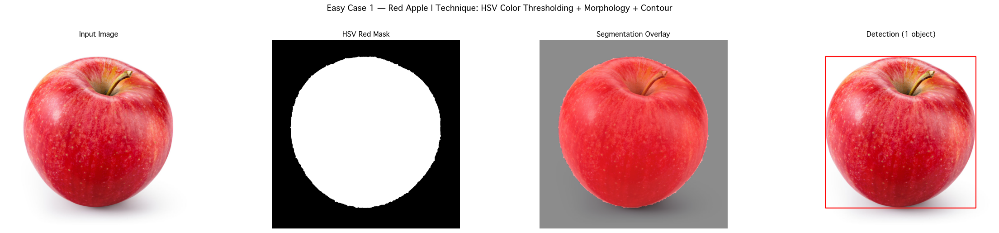
*   **E2 Banana:** Leveraged the bright, saturated yellow hue. Morphological closing was applied to fill small gaps caused by specular highlights on the skin.
    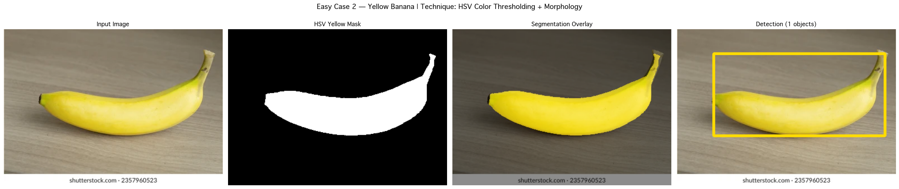
*   **E3 Basketball:** The unique orange hue of a basketball is highly specific. It was easily isolated from gym floors or neutral backgrounds using a narrow Hue band.
    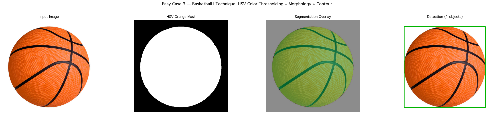
*   **E4 Tennis Ball:** Fluorescent "Optical Yellow" has a specific wavelength (Hue 30-80). This color rarely appears in natural backgrounds, resulting in a very clean mask.
    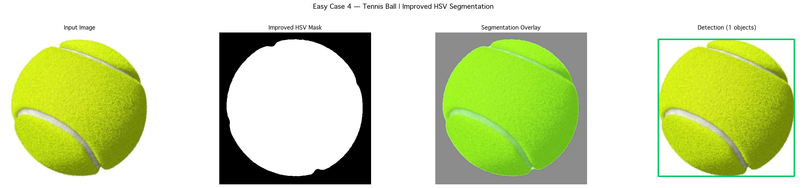
*   **E5 Fire Extinguisher:** Deep industrial red was separated from light-colored walls using a robust HSV range, reinforced by area-based filtering to remove noise.
    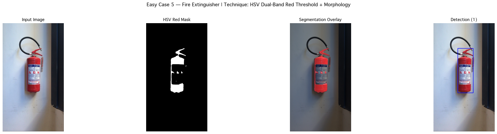
*   **E6 Clouds:** Since clouds are achromatic, traditional color masking fails. We used Otsu's Thresholding on Grayscale images to separate bright white clouds from the darker blue sky.
    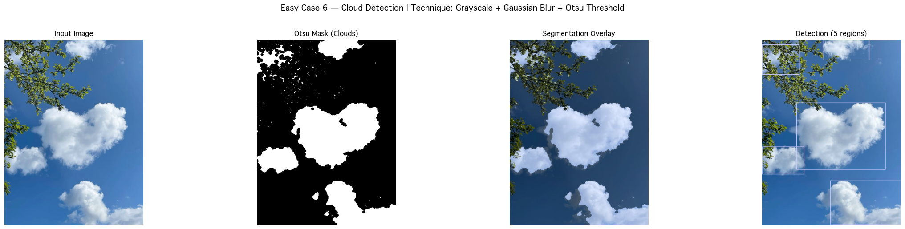
*   **E7 Pumpkin:** Vibrant orange against a dark background. Morphological opening was used to strip away the green stem, leaving only the fruit body.
    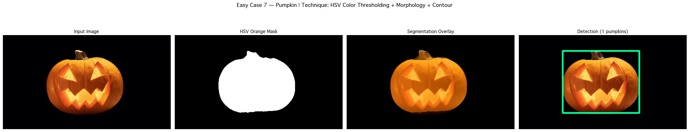
*   **E8 Rose:** The distinct pink/magenta hue was successfully separated from the surrounding green leaves using precise Hue-range targeting.
    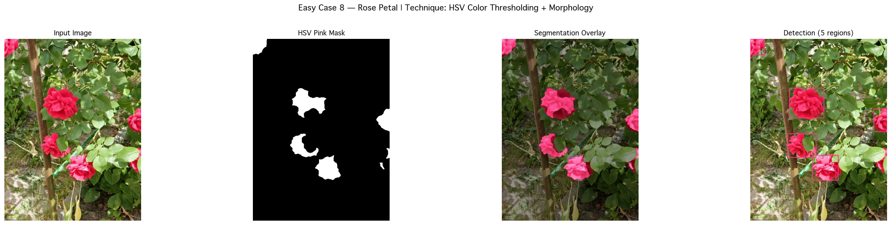
*   **E9 Watermelon:** Focused on segmenting the internal red flesh. A specific red-mask was used to ignore the green rind and the surrounding environment.
    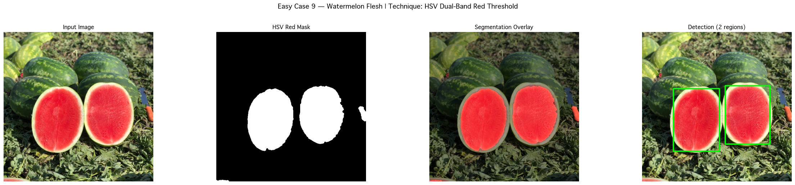
*   **E10 Traffic Light:** Targeted the high-intensity green signal. By filtering for both high Saturation and high Value, the active lamp was accurately isolated.
    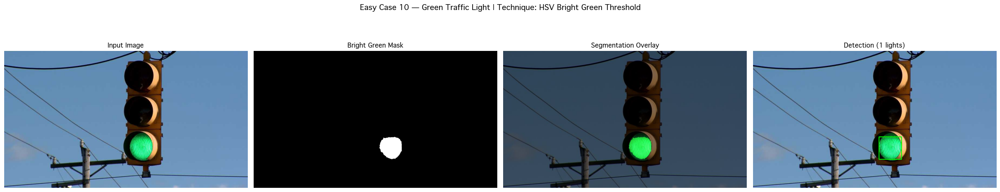

---

### 🟡 Group 2: Difficult Success (D1–D10)
**Key Strategy:** Advanced Pre-processing & Multi-stage Algorithms. These cases involve low contrast, overlapping objects, or subtle color cues.

*   **D1 White Plate:** White-on-white challenge. Small intensity differences at the rim were captured using Canny edges, followed by GrabCut to extract the plate from the bright tablecloth.
    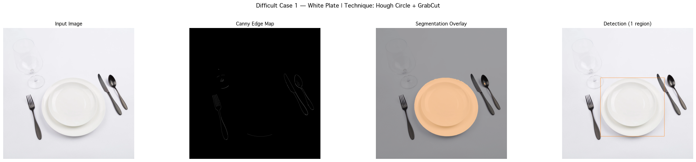
*   **D2 Mushroom:** Brown mushroom on a forest floor. LAB a-channel (red-green axis) was used to separate the warm mushroom tones from the neutral/cool dirt and leaves.
    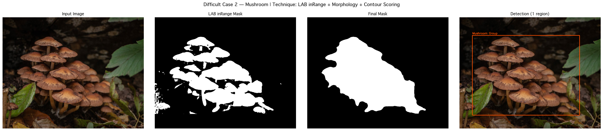
*   **D3 Lemons:** Touching instances. Distance Transform was used to find the "peak" of each lemon, which served as seeds for a Watershed algorithm to split overlapping boundaries.
    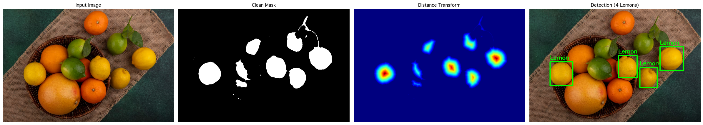
*   **D4 Polar Bear:** White fur on white snow. CLAHE amplified local fur texture, and LAB b-channel separated the bear's warm tint from the cool, blue-white snow crystals.
    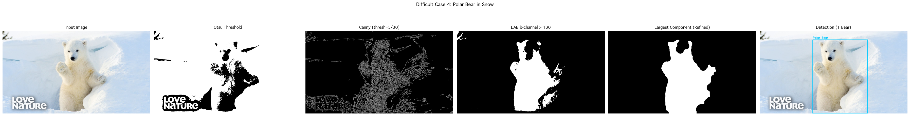
*   **D5 Chameleon:** Master of camouflage. Sobel Gradient Magnitude was used to detect the localized, high-frequency texture of scales, which differs from the smooth texture of leaves.
    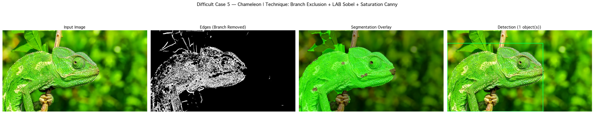
*   **D6 Complex Cat:** Cat on a cluttered background. Bilateral filtering removed background noise while preserving the cat's edges, allowing Canny to find a coherent silhouette.
    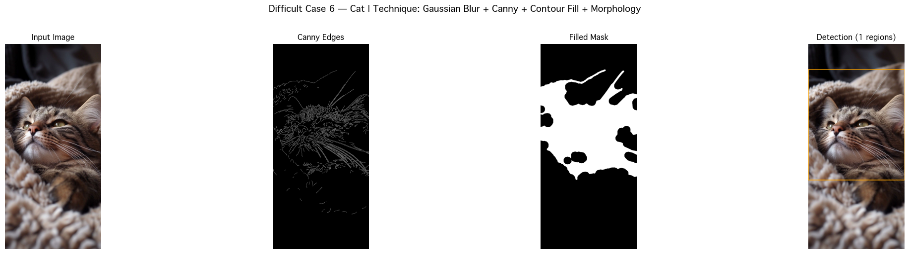
*   **D7 Zebra:** High-contrast patterns. Sobel operators targeted the high-frequency black and white stripes, creating a dense gradient field used to identify the animal's location.
    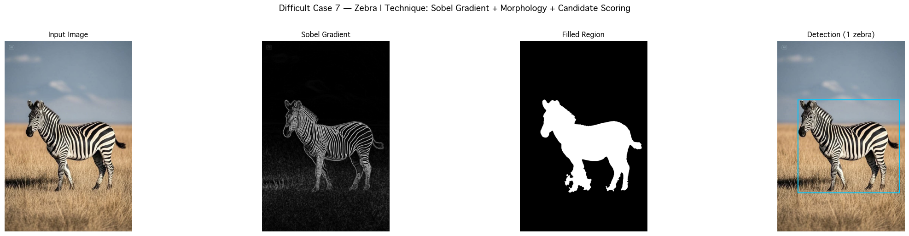
*   **D8 Street Sign:** Partially occluded by branches. HSV yellow masking was followed by a large Morphological Closing operation to "repair" the sign's shape behind the branches.
    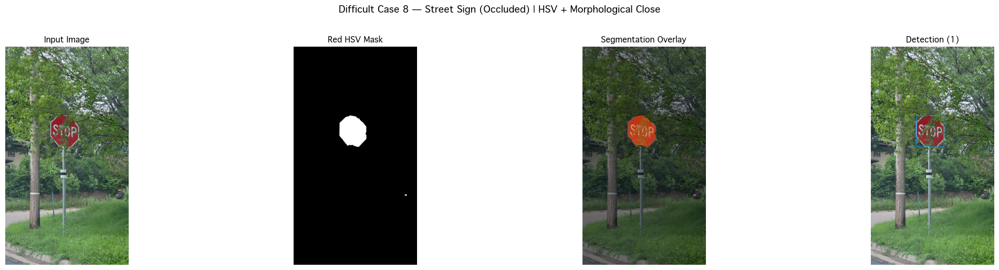
*   **D9 Foggy Mountain:** Low contrast due to heavy haze. CLAHE (Dehazing) was used to locally normalize brightness, making the mountain's horizon detectable via Canny.
    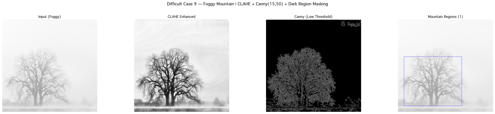
*   **D10 Glass Bottle:** Transparency challenge. GrabCut in "Rectangle Mode" was used to iterate on the subtle light refraction patterns at the edges, establishing a solid foreground mask.
    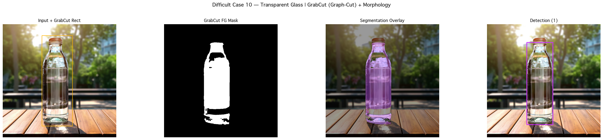

---

### 🔴 Group 3: Failed as Expected (FE1–FE10)
**Key Strategy:** Evolutionary Camouflage (Zero Signal). In these cases, the object has evolved to share identical color, edge, and texture properties with its environment.

*   **FE1 Camo Soldier:** The pattern is designed to break up silhouettes and match the surrounding forest's color and texture frequency, leaving no signal for traditional CV.
    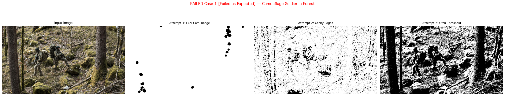
*   **FE2 Camo Owl:** The owl's feathers mimic tree bark patterns so perfectly that even Gabor texture analysis sees the image as a single, continuous material.
    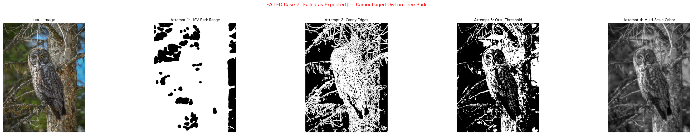
*   **FE3 Reef Fish:** Vibrant but fragmented colors match the surrounding coral reef. The algorithm segments the fish into many tiny colorful blobs instead of a single object.
    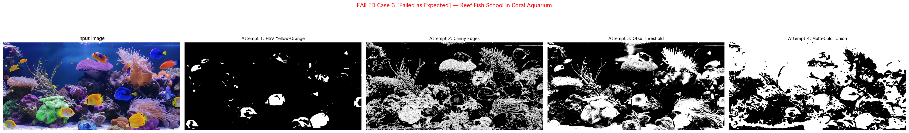
*   **FE4 Stick Insect:** Both color and "geometric shape" mimic a tree branch. There is no distinguishable difference between the insect's legs and the surrounding twigs.
    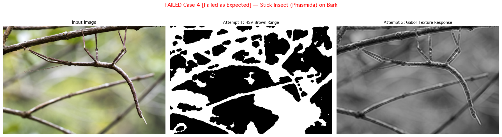
*   **FE5 Red Umbrella:** Placed among a pile of red tomatoes. The Hue, Saturation, and Value are identical, causing the algorithm to merge the umbrella with the produce.
    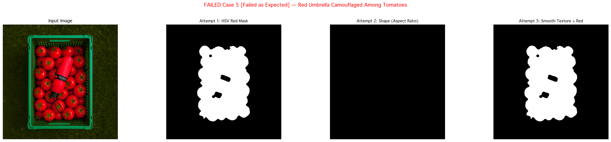
*   **FE6 Nude Dress:** The dress color matches the subject's skin tone exactly. In every color space, there is no detectable boundary between the person and the garment.
    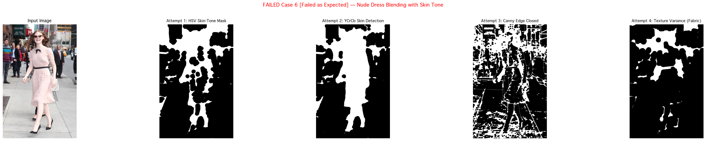
*   **FE7 Night Scene:** Extreme underexposure. The image data sits at the "noise floor" (near zero intensity), meaning no amount of enhancement can recover the object's shape.
    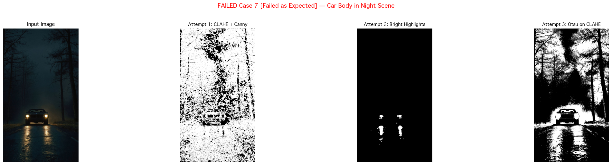
*   **FE8 Sea Turtle:** The turtle's shell pattern mimics the textures of a coral reef. Canny detects the chaotic patterns of the reef and shell as one continuous edge field.
    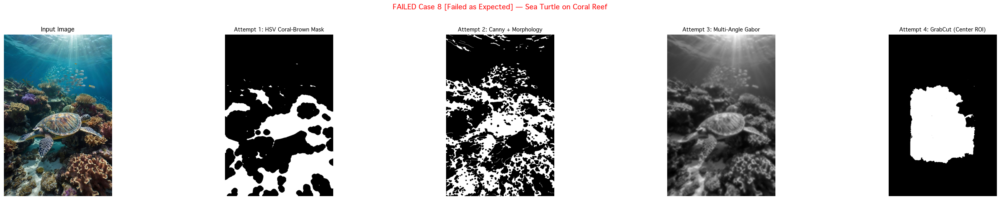
*   **FE9 Flounder:** A flatfish that partially buries itself in sand. It mimics the color and granularity of the sand so perfectly that it becomes part of the background plane.
    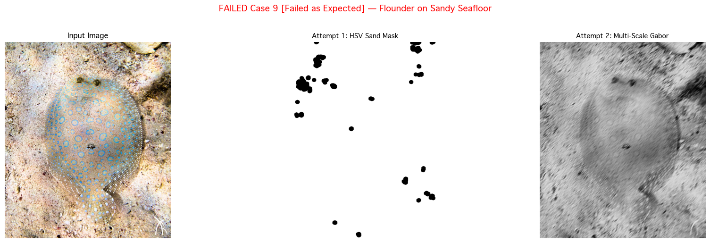
*   **FE10 Dense Crowd:** Overlapping humans in a tight group. Without semantic understanding of "human bodies," traditional CV sees a single, large, chaotic mass of texture.
    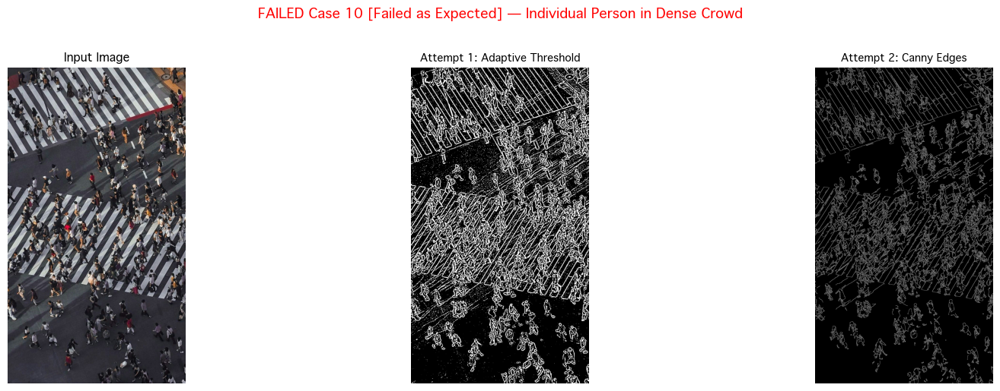

---

### 🟠 Group 4: Failed but Unexpected (FU1–FU10)
**Key Strategy:** Environmental Noise & Global Threshold Failure. These cases logically should be possible but are foiled by specific lighting or material artifacts.

*   **FU1 Hard-Boiled Egg:** White egg on a white plate. High-quality lighting removes shadow cues, making the boundary pixels identical in intensity. No intensity gradient exists.
    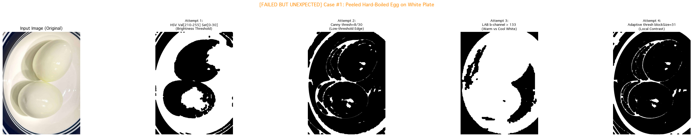
*   **FU2 Coin on Wood:** Reflections on a metallic surface. The coin reflects the wood grain of the table, making it appear "transparent" to the segmentation algorithm.
    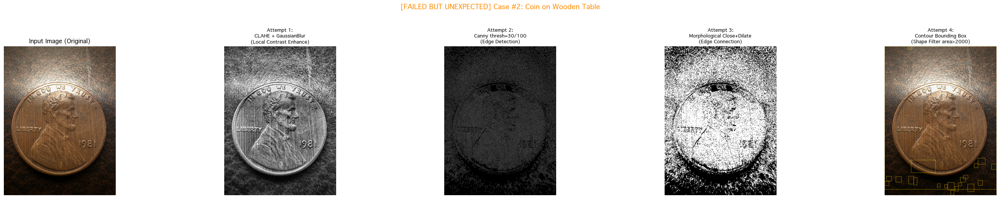
*   **FU3 White Mug:** Specular highlights. The bright reflection of lights on the ceramic surface is brighter than the mug itself, creating "holes" in the mask where the light hits.
    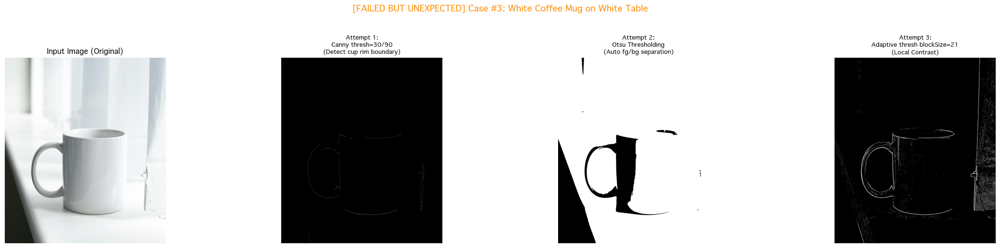
*   **FU4 Black Cat:** Black cat on a black sofa. Both exist in the lowest 5% of the intensity range (Value 0-20). Contrast enhancement fails because the data is too compressed.
    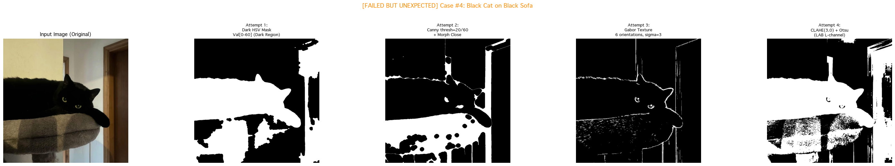
*   **FU5 Bread Loaf:** Brown loaf on a brown board. The shadow cast by the bread has a sharper edge than the bread itself, causing Canny to detect the shadow as the object.
    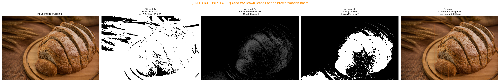
*   **FU6 Snowy Owl:** Similar to the Polar Bear but with softer edges (downy feathers). This prevents Canny from finding a closed loop for the body silhouette.
    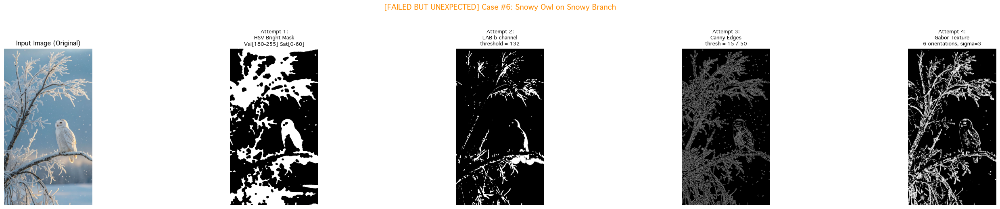
*   **FU7 Factory Smoke:** Transparency and diffusion. Smoke has no defined "edge." Its boundary is a gradient of transparency that blends into the cloud background.
    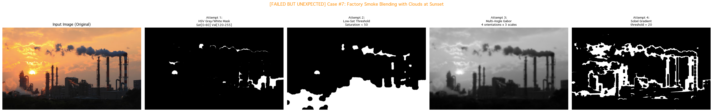
*   **FU8 Wooden Chair:** Material match. The wood of the chair and the floor share identical grain direction and color, allowing Morphological operations to merge them together.
    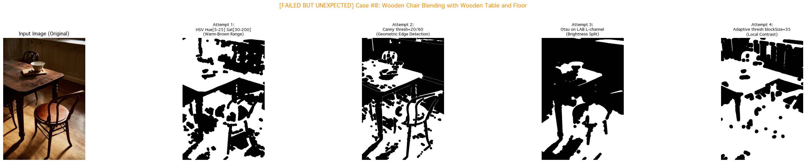
*   **FU9 Underwater:** Light scattering (haze). Water acts as a blue-green color filter and a diffuser, destroying contrast and making edges blurry and undetectable.
    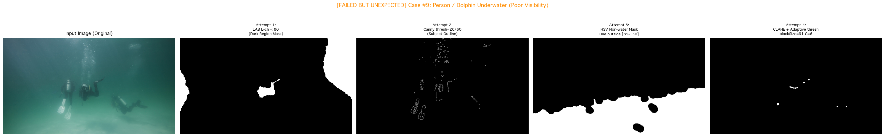
*   **FU10 Orange Cat:** Color and texture overlap. The cat's stripes align with the fabric weave of the sofa, confusing Gabor and edge analysis into seeing a single textural plane.
    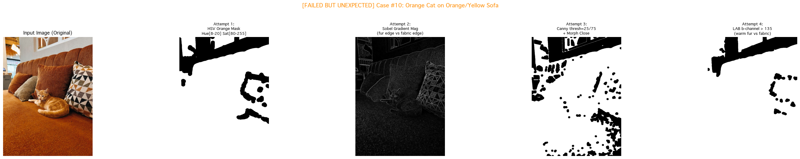

---

## �📊 Summary Table: 40 Cases

| # | Case | Technique(s) | Key Parameters |
|---|------|-------------|----------------|
| **E1** | Red Apple | HSV Dual-Band Red + Morphology | Hue[0-10, 160-180], Sat[120-255] |
| **E2** | Banana | HSV Yellow Range + Morphology | Hue[20-35], Sat[105-255] |
| **E3** | Basketball | HSV Orange Range + Morphology | Hue[5-25], Sat[180-255] |
| **E4** | Tennis Ball | HSV Yellow-Green + Morphology | Hue[30-80], Sat[60-255] |
| **E5** | Fire Extinguisher | HSV Dual-Band Red + Large Morphology | Hue[0-12, 158-180], Sat[120-255] |
| **E6** | Clouds | Grayscale + Gaussian Blur + Otsu | Blur(5x5), Otsu auto |
| **E7** | Pumpkin | HSV Orange + Morphological Open/Close | Hue[6-18], Sat[130-255] |
| **E8** | Rose | HSV Pink Range + Morphological Ops | Hue[170-175], Sat[120-200] |
| **E9** | Watermelon | HSV Dual-Band Red + Large Morph Close | Hue[0-12, 165-180] |
| **E10** | Traffic Light | HSV Bright Green (High Value) | Hue[45-90], Val[180-255] |
| **D1** | White Plate | Canny Edge Detection + GrabCut Seed | Canny(40,110), 10 iterations |
| **D2** | Mushroom | LAB a-channel Threshold + Morphology | A > 145 (pink/brown) |
| **D3** | Lemons | HSV + Distance Transform + Watershed | Dist Threshold(0.65xMax) |
| **D4** | Polar Bear | CLAHE + LAB Fusion + GrabCut Refinement | CLAHE(2.5), GrabCut(5 iter) |
| **D5** | Chameleon | HSV Threshold + Sobel Gradient | Threshold(18) |
| **D6** | Cat (Complex) | Canny + Contour Fill + Large Morphology | Canny(20,80), Close(15x15) |
| **D7** | Zebra | Sobel Gradient Magnitude + Threshold | Threshold(52) |
| **D8** | Street Sign | HSV Yellow + Morphological Close | Hue[170-180], Sat[90-255] |
| **D9** | Foggy Mountain | CLAHE + Low-Threshold Canny | Canny(15,50), CLAHE(4.0) |
| **D10** | Glass Bottle | Canny + Morph Close + GrabCut | 5 iterations, Rect mode |
| **FE1** | Camouflage Soldier | HSV + Canny | Failed (Pattern matching bg) |
| **FE2** | Camouflaged Owl | HSV + Canny + Gabor Texture | Failed (Texture mimicry) |
| **FE3** | Reef Fish | RGB / HSV Colorphase Masking | Failed (Complex background) |
| **FE4** | Stick Insect | HSV + Gabor Filter Bank | Failed (Shape/Texture) |
| **FE5** | Red Umbrella | HSV Red Band Masking | Failed (Color mimicry) |
| **FE6** | Nude Dress | HSV Skin-Tone Range | Failed (Color matching skin) |
| **FE7** | Night Scene | Low-Intensity Intensity Thresholding | Failed (Extreme darkness) |
| **FE8** | Sea Turtle | HSV + Gabor Texture Energy | Failed (Pattern overlap) |
| **FE9** | Flounder Fish | Gabor Texture + HSV | Failed (Perfect matching) |
| **FE10** | Dense Crowd | Canny Edge Density | Failed (Semantic overlap) |
| **FU1** | Hard-Boiled Egg | HSV + Canny + LAB + Adaptive | Failed (White on White) |
| **FU2** | Coin on Wood | CLAHE + Canny + Morphology | Failed (Wood Grain Noise) |
| **FU3** | White Coffee Mug | Canny + Otsu + Adaptive | Failed (Specular Highlights) |
| **FU4** | Black Cat | Dark HSV + Canny + Gabor + CLAHE | Failed (Same Dark Color) |
| **FU5** | Bread Loaf | Brown HSV Mask + Canny | Failed (Shadow/Grain) |
| **FU6** | Snowy Owl | HSV + LAB b-ch + Canny + Gabor | Failed (White on White) |
| **FU7** | Factory Smoke | HSV + Gabor + Sobel Gradient | Failed (Transparency/Clouds) |
| **FU8** | Wooden Chair | HSV + Canny + LAB + Adaptive | Failed (Material/Texture match) |
| **FU9** | Underwater | LAB + Canny + HSV + CLAHE | Failed (Scattering/Cast) |
| **FU10** | Orange Cat | HSV + Sobel + Canny + LAB | Failed (Color/Texture overlap) |

---

### 💡 Key Learning Points
1. **Color-based methods (HSV)** work best when objects have *unique, saturated hue* different from background.
2. **Edge-based methods (Canny, Sobel)** work when objects have clear *intensity discontinuity* at boundaries.
3. **Morphological operations** are critical post-processors that bridge gaps and remove noise.
4. **Watershed + Distance Transform** separates touching/overlapping same-color objects.
5. **CLAHE** rescues low-contrast/foggy images by locally normalizing brightness.
6. **Gabor filters** detect texture-based boundaries when color is insufficient.
7. **LAB color space** better separates perceptually different colors that look close in HSV/RGB.
8. **Traditional methods fundamentally lack** semantic understanding — they cannot reason about *what* or *where* objects conceptually are.
